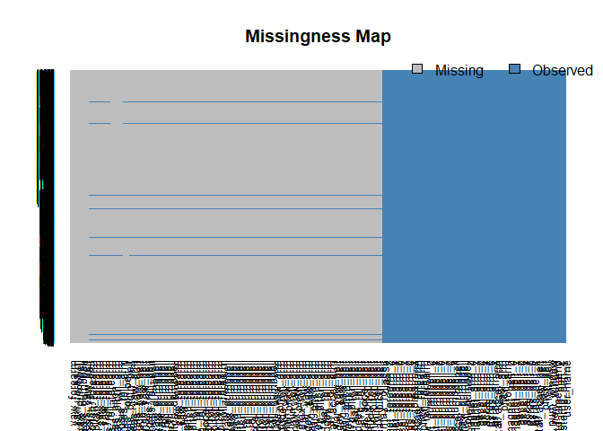

# Peer-graded Assignment: Machine Learning Course Project
Kitoogo Fredrick  
13th October 2017  
# Executive Summary

The goal of this project is to use data from accelerometers on the belt, forearm, arm, and dumbell of 6 participants. They were asked to perform barbell lifts correctly and incorrectly in 5 different ways. More information is available from the website here: http://groupware.les.inf.puc-rio.br/har (see the section on the Weight Lifting Exercise Dataset).

Specifically, the following questions are answered:

1. Prediction of the manner in which the participants did the exercise (the "classe" variable in the training set).  Several models were built and the best fitted model is chosen, amongst others using cross-validation. 

2. Computation of the expected out of sample error and why the choices were made.

3. Use the prediction model to predict 20 different test cases.

# Set the Environment and read the Data


```r
## Setting the Environment
library(caret)
library(Amelia)
library(pgmm)
library(rpart)
library(rpart.plot)
library(gbm)
library(lubridate)
library(randomForest)
library(e1071)
library(rattle)

# setting the seed for reproducible computation
set.seed(12345)

## Set the Working Directory
setwd("P:/NITA/New/Personal/Training/Data Science/John Hopkins/Course  8 - Machine Learning/Week 4/Course Project")
```

The data was extracted from the Weight Lifting Data Set in which Six young health participants were asked to perform one set of 10 repetitions of the Unilateral Dumbbell Biceps Curl in five different fashions: exactly according to the specification (Class A), throwing the elbows to the front (Class B), lifting the dumbbell only halfway (Class C), lowering the dumbbell only halfway (Class D) and throwing the hips to the front (Class E).

# Read the Data


```r
training <- read.csv("pml-training.csv", na.strings = c("NA", "#DIV/0!", ""))  # Training Data

testing <- read.csv("pml-testing.csv", na.strings = c("NA", "#DIV/0!", ""))  # Test Data
```

The training set is comprosed of Data Frame is composed of 19622 obs. of  160 variables the testing set
is comprised of 20 obs. of  160 variables. 

# Perform Data Processing and Feature Selection

We start by visualization of the data to identify whether there is missing data. 


```r
missmap(training[-1], col = c("grey", "steelblue"), y.cex = 0.5, x.cex = 0.8)
```

<!-- -->
We note that there is a lot of missing data. 

# Partition the Train data set into a training and validation data set

```r
inTrain <- createDataPartition(y = training$classe, p = 0.7, list = FALSE)
newTraining <- training[inTrain, ]
newTesting <- training[-inTrain, ]
dim(newTraining)
```

```
## [1] 13737   160
```

```r
dim(newTesting)
```

```
## [1] 5885  160
```

The following strategy is used to decrease the number of Variables/Features basing on the premise of remaining with the most relevant ones:

1. Remove idenfication and meta-data that is not important in model building 
2. Remove Variables/features that have a near zero variance (unlikely to be predictive)
2. Remove Variables/Feature observations that are dominated (more than 80%) by "NA" (unlikely to be predictive)


```r
## Remove first seven variables in the data sets seem to be Meta Data that is
## not important in model ## ## buidling and prediction
newTraining <- newTraining[, -c(1:7)]  ## Subset the Training data set
newTesting <- newTesting[, -c(1:7)]  ## Subset the Validation data set

## Remove those Variables with features that have a near zero variance
nearXeroVarCols <- nearZeroVar(newTraining)
newTraining <- newTraining[, -nearXeroVarCols]
newTesting <- newTesting[, -nearXeroVarCols]

## Remove features dominated by NAs (more than 80%)
colIndexToRemove <- which(colSums(is.na(newTraining))/length(newTraining) > 
    0.8)
newTraining <- newTraining[, -c(colIndexToRemove)]
newTesting <- newTesting[, -c(colIndexToRemove)]

dim(newTraining)
```

```
## [1] 13737    53
```

```r
dim(newTesting)
```

```
## [1] 5885   53
```

# Model Buidling
Basiing on the type of question at hand, we chosse the algorithms based on their suitability for the problem. This is a classification problem. 

We build the following nmodels based on different Machine Learning Algorithms

1. Decision Tree
2. Gradient Boosting
3. Random Forest


```r
## Start by setting up a varible to be used in train to use 5-fold CV
fitControl <- trainControl(method = "cv", number = 5)

## Build the the different models
modFitDT <- invisible(train(classe ~ ., data = newTraining, method = "rpart", 
    trControl = fitControl))
modFitGB <- invisible(train(classe ~ ., data = newTraining, method = "gbm", 
    trControl = fitControl))
modFitRF <- invisible(train(classe ~ ., data = newTraining, method = "rf", trControl = fitControl))
```

# Test the Models


```r
predictDT <- predict(modFitDT, newdata = newTesting)
cmDT <- confusionMatrix(predictDT, newTesting$classe)  ## Confustion Matrix

predictGB <- predict(modFitGB, newdata = newTesting)
cmGB <- confusionMatrix(predictGB, newTesting$classe)  ## Confusion Matrix

predictRF <- predict(modFitRF, newdata = newTesting)
cmRF <- confusionMatrix(predictRF, newTesting$classe)  ## Confusion Matrix

AccuracyMatrix <- data.frame(Model = c("Decision Tree", "Gradient Boosting", 
    "Random Forest"), Accuracy = rbind(cmDT$overall[1], cmGB$overall[1], cmRF$overall[1]))

print(AccuracyMatrix)
```

```
##               Model  Accuracy
## 1     Decision Tree 0.4963466
## 2 Gradient Boosting 0.9578590
## 3     Random Forest 0.9896347
```

The model based on Random Forest is the most accurate, with the Gradient Boosting coming second and the Decision Tree performing worst.

# The Expected Out-Of-Sample Error
The expected out-of-sample error will correspond to the quantity: 1-accuracy in the cross-validation data. We use the most accurate model to compute the Expected Out-of-Sample Error.


```r
cat("Out of Sample Error is = ", 1 - cmRF$overall[1])
```

```
## Out of Sample Error is =  0.01036534
```

# Predict 20 different test cases.
Use the most accurate mnodel based on Random Forest to predict on the original Testing Data Set.


```r
predicted <- predict(modFitRF, newdata=testing)
print(as.data.frame(predicted))
```

```
##    predicted
## 1          B
## 2          A
## 3          B
## 4          A
## 5          A
## 6          E
## 7          D
## 8          B
## 9          A
## 10         A
## 11         B
## 12         C
## 13         B
## 14         A
## 15         E
## 16         E
## 17         A
## 18         B
## 19         B
## 20         B
```

# Conclusion
The models based on Gradient Boostng and Random Forest using cross validation are the most accurate althougth the Random Forest is the most accurate. 


<!-- ### Appendix  -->
<!-- ```{r, ref.label=knitr::all_labels(),echo=TRUE,eval=FALSE} -->
<!-- ``` -->


